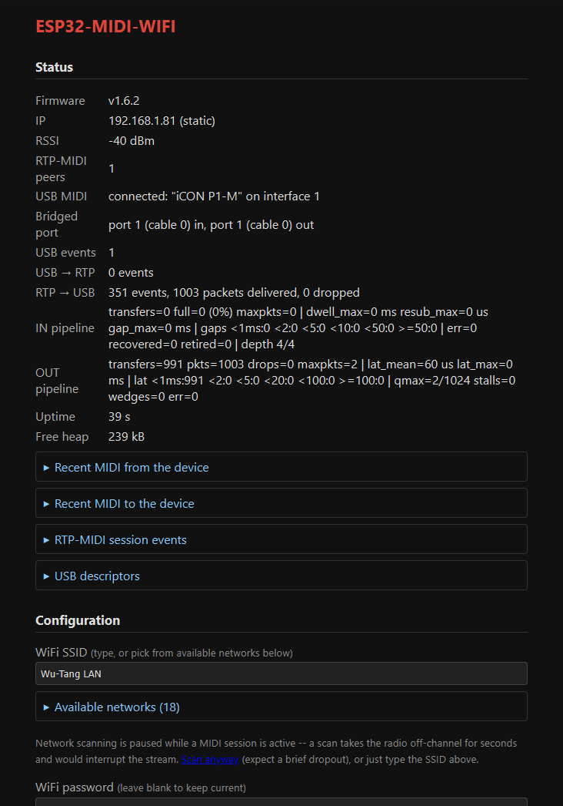

# ESP32-MIDI-WIFI

[](https://github.com/Fohdeesha/ESP32-MIDI-WIFI/actions/workflows/build.yml)

Firmware for the ESP32-S3 that turns any class-compliant USB MIDI device into a
wireless one. Plug a keyboard or controller into the ESP32-S3's USB OTG port
(host mode) and its MIDI events are bridged — in both directions — over WiFi
using RTP-MIDI (AppleMIDI, RFC 6295), so it shows up in macOS, Windows
(rtpMIDI), and Linux as a standard network MIDI session.

**Current version: 1.7.1**



## How it works

```
USB MIDI device (keyboard, controller, control surface)
      │  ▲  USB OTG host mode (ESP-IDF usb_host stack)
      ▼  │
USB MIDI class driver ◄──► MIDI event queues (FreeRTOS)
                                │  ▲
                                ▼  │
                     RTP-MIDI / AppleMIDI session
                     (UDP ports 5004/5005)
                                │  ▲  WiFi
                                ▼  │
                        DAW / network MIDI host
```

The bridge is fully bidirectional: notes and controls flow from the USB device
to the network, and network MIDI flows back to the device (LEDs, motorized
faders, displays on control surfaces). SysEx is chunked and reassembled
correctly in both directions. Which of the device's MIDI ports is bridged is
configurable per direction (default: the first port, both ways).

## Features

- **USB host** for class-compliant USB MIDI devices, including workarounds for
  common descriptor quirks (e.g. devices that report a high-speed bulk packet
  size on a full-speed link), automatic retry of a device that fails to
  enumerate — so a self-powered device left on while the bridge reboots is
  picked up again without power-cycling it — and recovery from USB transfer
  errors (the endpoint is cleared and the transfer resubmitted, escalating to a
  port reset if errors persist) instead of a direction going dead until the
  device is replugged.
- **Selectable MIDI port**: multi-port devices present several virtual cables
  (and occasionally several MIDI interfaces) — pick which one to bridge from
  the web UI, separately per direction if a device needs it, or merge every
  incoming port into one stream. The picker lists what the attached device
  actually presents, with live per-port event counters so you can tell which
  port your controller is really using, and warns if a selected port is beyond
  what the device declares in that direction.
- **Bidirectional RTP-MIDI bridge** hardened for sustained high-rate traffic
  (every network datagram parsed on its own, so a truncated or malformed one
  costs only itself; SysEx of any length in both directions; deep TX queue with
  backpressure so device-bound SysEx bursts don't tear) and for low latency:
  the main loop is kept free of blocking calls, including in the upstream
  AppleMIDI library, and runs at ~480 Hz under a heavy bidirectional load.
  Channel messages, SysEx, and MIDI clock, transport and timecode (System
  Real-Time and System Common) all pass both ways.
- **Session listener and initiator**: by default the device accepts incoming
  AppleMIDI invitations; optionally configure a peer IP:port and it will
  initiate (and re-invite every 30 s until connected). A host that vanishes
  without ending its session (asleep, crashed, out of range) is dropped after
  150 s without clock sync, and the attached surface blanked.
- **Web config UI** (`http://esp32-midi.local/`): status, WiFi and network
  settings, RTP-MIDI session settings, MIDI port selection, password
  management, reboot, factory reset, and a live diagnostics view in collapsible
  sections (USB state, what is electrically on the USB port, USB IN- and
  OUT-pipeline statistics, decoded recent MIDI events in both directions with
  their port numbers, RTP-MIDI session event log, the USB driver's own error
  log, USB descriptor dump). A plain-text `/diag` endpoint carries the same counters
  in a few hundred bytes, cheap enough to poll once a second while measuring
  throughput; `POST /diagreset` zeroes the diagnostic counters for a fresh run,
  leaving the running totals alone. Settings-changing requests from other
  websites are refused, so a page open in the same browser can't reconfigure,
  reflash or reset the bridge with its stored login; settings can be changed
  only with the page opened as `http://esp32-midi.local/` or by IP address
  (another DNS name for the device can view it, not change it).
- **Static IP or DHCP** (DHCP by default), configurable from the web UI with
  validation.
- **WiFi health diagnostics and reconnect hardening**: every station disconnect
  is logged and counted with its reason code (beacon timeout, AP not found,
  auth failure, ...), a WiFi event log on the status page keeps the recent
  history with the last-known RSSI, `/diag` carries it all in one line together
  with the chip's last reset reason (power-on vs brownout vs crash), and a
  station that stays down for 15 s gets an explicit reconnect kick instead of
  trusting auto-reconnect indefinitely. TX power is configurable from the web
  UI (default: maximum).
- **OTA firmware updates** over HTTP — no serial connection needed once the
  device is on your network. Malformed or interrupted uploads are rejected
  safely, and a boot guard auto-rolls-back to the previous firmware if a new
  image crash-loops (3 boots in a row ending in a crash; power cuts don't
  count). A watchdog turns a hang into such a crash, so a hung bridge also
  restarts itself.
- **Setup AP fallback**: if the configured WiFi has been unreachable for 30 s
  in a row, the device opens its own configuration access point while
  continuing to retry, and closes it once the station is back.
- **WS2812 status LED**: WiFi/session state and MIDI activity at a glance.
- **No baked-in credentials**: all configuration lives in NVS flash, never in
  the source or the binary.

## Hardware

- ESP32-S3 dev board (default target: `esp32-s3-devkitc-1` with 16 MB flash /
  8 MB PSRAM; adjust `board`/`board_build` in `platformio.ini` for other
  hardware).
- The S3's USB OTG peripheral (GPIO19/20) is used for host mode, so serial
  console and flashing go through the board's UART port — use the connector
  labeled **UART** on dual-port devkits.
- In host mode the board must supply 5 V VBUS to the attached device. Most
  devkits need a jumper or external 5 V feed for this (e.g. the USB-OTG pad on
  the DevKitC-1).
- Status LED is the devkit's onboard WS2812 on GPIO 48.

## Pre-built firmware

Every version is built by CI and published on the
[Releases](https://github.com/Fohdeesha/ESP32-MIDI-WIFI/releases) page, so
building from source is only necessary if you are changing the firmware. Each
release carries:

- `ESP32-MIDI-WIFI-<version>.bin` — the application image, for OTA updates.
- `ESP32-MIDI-WIFI-<version>-merged.bin` — a complete flash image for a blank
  board:

  ```sh
  esptool --chip esp32s3 write_flash 0x0 ESP32-MIDI-WIFI-<version>-merged.bin
  ```

- `bootloader.bin` and `partitions.bin`, if you prefer to flash the pieces
  separately (offsets 0x0 and 0x8000; the application goes at 0x10000).

## Building

Requires [PlatformIO](https://platformio.org/).

```sh
pio run                  # build
pio run -t upload        # first flash (via the UART port)
pio device monitor       # serial console, 115200 baud
```

The build runs `tools/patch_applemidi.py` first, which fixes bugs in the
AppleMIDI dependency's only release (3.3.0): a per-SysEx-byte `Serial.print`
left in as debug code (enough to stall the main loop for hundreds of
milliseconds under a SysEx load, see 1.5.0), a session timeout that this
build's initiator support compiled out, a lost invitation reply that locked a
peer out, recovery-journal and datagram parsing that spliced one packet into
the next, and phantom packet-loss reports at every sequence-number wrap (see
1.7.2). Each patch is an exact-text replacement: the script is idempotent,
fails the build if the library ever changes upstream, and stamps the patched
copy with a version that the firmware checks at compile time — so it can
never be built against an unpatched library.

Subsequent updates can go over the air instead:

```sh
pio run
curl -u admin:<password> -F "fw=@.pio/build/esp32-s3-devkitc-1/firmware.bin" http://esp32-midi.local/update
```

## First-time setup

The firmware ships with no credentials baked in. On first boot (or after a
factory reset) the device opens a WiFi access point:

- **SSID:** `ESP32-MIDI-Setup` · **password:** `midimidi`
- Join it and browse to `http://192.168.4.1`
- Log in with the default credentials: username **admin**, password **midimidi**
  (changeable or removable on the config page)
- Enter your WiFi credentials and save; the device reboots onto your network
  and is reachable at `http://esp32-midi.local/`

## Configuration

Everything is set from the web UI:

- **WiFi**: SSID and password. The page lists nearby networks to pick from, but
  only scans while no MIDI session is connected — scanning takes the radio off
  its channel for several seconds, which would interrupt a live stream. During
  a session you can type the SSID, or use the "scan anyway" link and accept a
  brief dropout.
- **RTP-MIDI session name** shown to network peers.
- **Connect to peer**: leave blank to accept incoming session invitations, or
  enter an IP (and port) to have the device initiate the session — useful when
  the other end is also a listener.
- **USB MIDI interface**: which MIDI function of the attached device to claim.
  Almost every device has exactly one, so leave this on *Auto*; the list shows
  each MIDIStreaming interface the device presents and how many virtual cables
  it declares in each direction. A saved selection that isn't on the currently
  attached device falls back to the first usable one, and the status line says
  so rather than silently going quiet.
- **USB MIDI port, device → network**: which of the device's virtual cables
  (the "ports" a DAW would list — MIDI 1, MIDI 2, …) to forward to the
  network. Defaults to port 1. Ports the device declares are marked, and any
  port that has carried traffic shows its event count, so you can identify the
  right one even for devices whose descriptors understate what they have.
  *All ports* merges every incoming port into the single network stream.
- **USB MIDI port, network → device**: where network MIDI is sent on the
  device. Defaults to *same as the port above*, which is what a control
  surface needs — it expects its LEDs and faders back on the port it sent
  from. Set it explicitly for the two cases where the directions differ: a
  device that declares a different number of ports each way, and *All ports*
  in the other direction (a merged input has no single port for the return
  path to follow). The page warns if either selection is beyond what the
  device declares for that direction.

  Changes to any of the three take effect after the reboot that saving
  triggers.
- **Static IP**: leave blank for DHCP, or set address, subnet mask, gateway
  (optional), and DNS (optional, defaults to the gateway). Inputs are
  validated before saving. Note that a wrong-but-valid static address can make
  the device unreachable; recovery is the BOOT-button factory reset below.
- **Web UI password**: HTTP Basic auth (username `admin`) guarding the page,
  config changes, OTA uploads, reboot, and factory reset. Default `midimidi`;
  changeable or removable. Changes (including OTA uploads, also via `curl`)
  are accepted only for `esp32-midi.local` or the device's IP address.

Reboot (keeps all settings): button on the config page beside **Save &
reboot**, for a remote power-cycle equivalent.

Factory reset (erases all settings): button on the config page, or hold the
**BOOT button for 10 seconds** while the device is running — the recovery path
for a forgotten password or bad network config on a headless device.

## Version history

- 1.7.2 — **a full-code audit; every fix below is proven by a host-side test
  that fails on 1.7.1.** **Sessions:** a DAW that disappeared without ending
  its session (Mac asleep or crashed, out of WiFi range) stayed "connected"
  forever — the AppleMIDI library's session timeout was compiled out by the
  flag this build needs for initiator mode — so the surface was never blanked,
  and after two such losses every new invitation was refused until reboot.
  Such a session now ends after 150 s without clock sync. A lost reply to a
  DAW's invitation no longer locks that DAW out (its retry is answered again),
  and the connected-peer count can no longer drift on the library's duplicate
  or phantom callbacks: it used to stay at 1 after the last session ended (no
  blanking, and initiator mode never re-invited) or fall to 0 under a live
  session (surface blanked, device → network muted). **Network parsing:** each
  RTP-MIDI datagram is now parsed on its own. A truncated, malformed or
  multi-channel-journal packet used to be spliced into the next one — garbage
  MIDI to the device and swallowed clock-sync replies — and every
  sequence-number wrap logged phantom packet loss. **SysEx:** messages over 128
  bytes from the DAW reached the device torn (the MIDI library's internal
  segments were each sent as a complete message, markers included); they are
  stitched back into one. Device SysEx over 256 bytes was dropped; any length
  now goes out, segmented per RFC 6295, with one loop's output always inside a
  single WiFi datagram. A SysEx left unfinished is closed before anything else
  reaches the device. **MIDI clock, transport and timecode** now pass in both
  directions (they were dropped). **USB:** a transfer error used to leave that
  direction dead until the device was replugged; the endpoint is now cleared
  and the transfer resubmitted, escalating to a port reset if errors persist.
  A device that stops accepting data no longer stalls the main loop 20 ms per
  message, malformed descriptors can no longer be read past their end, a
  failed interface claim no longer overflows the heap, the IN-pipeline line
  counts packets lost to a full queue (`qdrop`), and the **USB port** row counts
  pipe clears and port resets. **WiFi:** after the first
  30 s of uptime, any momentary drop switched the radio into setup-AP mode in
  the middle of its own reconnect; the setup AP now opens only after 30 s down
  in a row, and every WiFi mode change is made from the main loop instead of
  racing it from the WiFi event task. The WiFi event log no longer freezes
  after 255 events. **Boot guard:** only crash resets count toward the
  automatic rollback — three quick power cycles (a battery bank cutting out)
  used to roll the firmware back to the previous version — and a 30 s loop
  watchdog now turns a hang into such a crash, so a hung bridge restarts
  itself (and a new image that hangs is rolled back too). **Web UI:**
  settings-changing requests from other websites are refused (Basic auth alone
  let any page open in a logged-in browser reconfigure, reflash or reset the
  bridge), and so are those addressed to a name other than
  `esp32-midi.local` or an IP address (DNS rebinding); displayed settings are
  HTML-escaped; inputs are length-checked
  (including a web password long enough to overflow the Arduino core's auth
  buffer) and static-IP settings that would leave the device unreachable are
  rejected; a settings save that fails to reach flash is reported (and the
  previous settings are put back) instead of "Saved" and then lost at the
  reboot; an OTA upload with no file is refused cleanly. The RTP-MIDI session log is rate-limited per exception type (one
  burst of junk used to rewrite its whole history) and ends with exact totals,
  and the status LED is decided in one place, so a session that survives a
  WiFi reconnect is shown as a session.
- 1.7.1 — **a device that fails its first enumeration is retried instead of
  abandoned.** ESP-IDF 4.4's USB host makes exactly one enumeration attempt per
  connection; if it fails, the stack waits for the device to disconnect before
  it will try again, and tells the application nothing, so the status page just
  read "no device". A bus-powered device gets that disconnect when it is
  replugged; a self-powered one never does. An Icon P1-M left switched on while
  the bridge lost power for hours was never seen again once the bridge came
  back, until the surface itself was power-cycled. The bridge now watches the
  port directly — the USB controller's connect-status bit says whether a device
  is electrically present, whatever the stack's state machine thinks — and when
  one has sat there for 5 s without enumerating, it makes the stack take its
  unplug-recovery path and enumerate the device afresh, backing off to once a
  minute for a device that never succeeds. It never touches a device that
  enumerated. The status page gains a **USB port** row (no device detected /
  device detected, not enumerated / attached, with the retry count), which
  separates "the device is not presenting itself at all" from "the device is
  there but failed to enumerate" — they used to read the same — and a **USB host
  stack errors** section carrying the USB driver's own error lines, which until
  now only ever reached the UART. `/diag` gains a matching `usb_port=` line.
- 1.7.0 — **WiFi dropouts are now self-diagnosing, and TX power is
  configurable.** A station disconnect used to change nothing but the status
  LED: no reason code, no counter, no history — so a device that fell off the
  network for minutes still read "good RSSI, zero errors" once it was back,
  which is exactly what happened in a real deployment (link degraded ~20 dB
  from its install-time survey; the dropouts were invisible from the device
  side). Every disconnect is now logged and counted with its reason code — the
  single most diagnostic byte a dropout produces: `BEACON_TIMEOUT` points at
  RF/interference/power, `NO_AP_FOUND` at the AP vanishing or changing
  channel, `AUTH_FAIL`/`ASSOC_FAIL` at AP-side refusal — a WiFi event log on
  the status page keeps the recent history with last-known RSSI, and `/diag`
  gains a `wifi=` line plus the chip's last reset reason (`POWERON` vs
  `BROWNOUT` vs `PANIC` distinguishes a pulled plug from a sagging supply from
  a crash). Recovery is hardened too: auto-reconnect has been observed wedged
  for minutes, so a station that stays down for 15 s now gets an explicit
  reconnect kick, repeated until the link returns. And **TX power is a config
  setting, default 19.5 dBm (the maximum)** — it had been pinned at 11 dBm
  since 1.5.x because full power once glitched the CH340 serial link at the
  bench, but that only matters with the UART cabled, and a deployed link whose
  RSSI has degraded needs the margin more; lower it from the web page if bench
  serial glitches return.
- 1.6.3 — **the bridge no longer rewrites null-velocity Note On as Note Off.**
  The MIDI library normalises an incoming Note On with velocity 0 into a Note
  Off by default — reasonable for a synth, wrong for a bridge, whose job is to
  pass through what it is given. It bit a real control surface: that surface
  drives its LED and touchscreen-cell state with Note On velocity 127 (on) /
  velocity 0 (off) — the form its own vendor scripts send, and the form it emits
  itself for a button release — and it ignores a true Note Off (0x80) for that
  state. So every host "lamp on" landed while every "lamp off" was discarded,
  leaving lamps and cells latched on until the surface was power-cycled, with
  the host sending correct bytes the whole time (confirmed by packet capture)
  and the device-bound event log showing this firmware converting them. Genuine
  Note Off messages are unaffected.

- 1.6.2 — diagnostics tidy-up. Resetting the diagnostic counters no longer
  rewinds the status page's running totals: "packets delivered" and "dropped"
  sit beside an event count the reset never touched, so zeroing one side of that
  row left it reading as a contradiction. The reset now clears only the
  measurement counters, and the IN/OUT pipeline lines carry their own
  per-measurement packet and drop counts so a run still describes itself. The
  reset endpoint is also **`POST /diagreset`** rather than a GET — it changes
  state, and a GET that does so can be tripped by a browser prefetch or a link
  scanner in the middle of a measurement.
- 1.6.1 — the **Reboot** button moved up next to **Save & reboot**, at the end
  of the configuration form, rather than sitting in a section of its own
  further down the page. Both are one click from the settings you have just
  been editing, and the reboot control is no longer easy to miss between the
  firmware update and factory reset blocks.
- 1.6.0 — **the device-bound pipeline is now measured, not just alarmed on.**
  The health check could already report a wedged device — an outgoing USB
  transfer left unacknowledged for more than 2 s — but only after the fact, and
  nothing showed how close ordinary traffic ran to that limit. A bulk transfer
  to a device that is keeping up completes in well under a millisecond; as the
  device's input buffer fills, its controller NAKs and the submit-to-completion
  latency grows continuously, long before anything trips. That latency is the
  headroom gauge, so the status page gained an **OUT pipeline** row: per-transfer
  latency mean/max and histogram, the producer-side queue high-water mark,
  packets packed per transfer, and stall/wedge/error counts. New with it: a
  plain-text `/diag` endpoint (a few hundred bytes, safe to poll once a second
  during a measurement, unlike the ~14 kB status page which perturbs the timing
  it is reporting) and `/diagreset` to zero the counters for a clean run.
  Measured with this against a live control surface: 6125 USB-MIDI packets per
  second sustained, 100% delivered, 59 µs mean transfer latency, queue
  high-water 2 of 1024, zero stalls.
- 1.5.4 — four fixes from a sustained-load audit. **USB IN pipeline depth
  raised from 2 to 4**: two is the bare minimum that keeps one transfer pending
  while the other is serviced, so a single slow service pass left the endpoint
  unpolled and the device began accumulating; four tolerates a late pass. **The
  session event log stopped eating itself** — while no peer is listening, the
  30 s invite retry wrote two ring entries per attempt (a retry exception plus a
  phantom disconnect for a session that never established), so a day of uptime
  showed only minutes of history and evicted anything diagnostic; repeats are
  now summarised and the phantom disconnect is ignored, which also stops it
  needlessly re-blanking the attached device's displays. **WiFi TX power is set
  before the connection starts**, so association cannot silently restore the
  default. **The status page reserves its buffer up front** instead of growing a
  ~14 kB string by dozens of reallocations inside the same loop that pumps MIDI.
- 1.5.3 — **the USB IN pipeline no longer decays.** Two USB IN transfers are
  kept in flight so the attached device always has somewhere to put a MIDI
  message. Previously, any transfer that came back with an error status was
  retired instead of resubmitted, so a single transient stall shrank the
  pipeline permanently — 2 in flight, then 1, then 0 — and only a replug or a
  reboot restored it. The symptom was incoming MIDI arriving in bunches (a
  device that accumulates messages while nothing is polling it) and eventually
  a device that appeared deaf while still enumerated. A transfer whose device
  is still present is now resubmitted, and only a genuinely disconnected device
  (or a resubmit that also fails) retires it. The status page gained an **IN
  pipeline** row to make this visible: completed transfers, how many came back
  with a full buffer, the worst submit-to-completion and completion-to-resubmit
  times, a completion-interval histogram, error/recovered/retired counts, and
  the current pipeline depth. That row separates "the device sent nothing" from
  "the host left the endpoint unpolled" — indistinguishable from the network
  side, and the reason the decay went unnoticed.
- 1.5.2 — a **Reboot** button on the config page, next to the firmware update
  and factory reset controls: restarts the device without touching any
  settings, for when a remote power-cycle is all that is wanted.
- 1.5.1 — status page tidy-up: the three diagnostic logs (recent MIDI from the
  device, recent MIDI to the device, RTP-MIDI session events) are now
  collapsible sections that start closed, like the USB descriptor dump, so the
  status table stays visible instead of being pushed off the top of the page by
  a long session log. Log text is also rendered a little larger, the page picked
  up a red accent for its title and buttons, and there is now an author/project
  footer.
- 1.5.0 — **large latency fix.** Under a sustained device-bound SysEx load (a
  control surface's displays), the main loop was collapsing from ~480 Hz to
  around 4 Hz, with single iterations as long as 240 ms. Incoming MIDI was then
  delivered in four clumps a second instead of continuously, ~6% of outgoing
  RTP packets were lost to the resulting back-to-back bursts, and inbound
  display writes were dropped wholesale. The cause was in the upstream
  AppleMIDI library: its SysEx parser prints every SysEx byte to `Serial`, in
  code that is not behind any debug switch, and Arduino-ESP32 gives
  `HardwareSerial` no TX buffer — so each byte cost ~434 µs of blocking UART
  whether or not anything was listening on the port. One 945-byte datagram took
  206 ms to parse. The library is patched at build time (`tools/`), and the
  build fails rather than silently reshipping the stall if a future release
  changes that code. A per-event `Serial` log on the USB → network path was
  removed for the same reason. Measured after: loop max 49 ms and zero
  iterations over 100 ms across 1.07 M iterations, no RTP packet loss.
  Also: browsing the web UI no longer starts a WiFi scan while a MIDI session
  is connected — a scan takes the radio off-channel for seconds and interrupted
  the stream. The network list is still scanned during setup, and there's an
  explicit "scan anyway" link
- 1.4.0 — the bridged port is now selectable per direction. The network → device
  port defaults to following the device → network one (what a control surface
  needs), and can be set independently for the two cases where that isn't
  right: devices that declare a different number of ports in each direction,
  and "all ports" merged inbound, which leaves the return path no single port
  to follow. Each port list is annotated from the descriptors for its own
  direction, and the page warns when a selection is beyond what the device
  declares that way
- 1.3.0 — selectable MIDI port: which MIDI function of the attached device
  (MIDIStreaming interface) and which of its up to 16 virtual cables get
  bridged are now set from the web UI, instead of being fixed at the first
  interface and cable 0. The picker lists what the device actually presents —
  every MIDIStreaming interface with its declared cable counts, plus live
  per-port event counters so a device whose descriptors understate its ports
  can still be configured from observed traffic — and "All ports" merges every
  port device → network. A saved selection that is absent on the attached
  device falls back to the first usable interface rather than leaving the
  bridge silently dead; send-only devices (no MIDI IN endpoint) are now
  supported; and the status page gained a device-bound MIDI event log next to
  the existing inbound one, both labelled with the port each message is on
- 1.2.0 — session health: the bridge now sends MIDI Active Sensing (0xFE)
  every 250 ms while (and only while) its USB device is attached and
  demonstrably working — IN pipeline live, OUT transfers ACKing — so a host
  can treat its absence as "bridge or device gone" within a second instead
  of waiting out a session timeout; explicit device attach/detach status
  messages (sysex F0 7D 55 4D 42 <state> F7); a deaf-but-enumerated USB
  pipeline now counts as unhealthy instead of silently looking fine; and on
  session loss the bridge blanks a Mackie-Control-family surface (displays,
  LEDs, meters) so a frozen display can't masquerade as a live one
- 1.1.0 — static IP support (web-configurable, validated, DHCP remains the
  default)
- 1.0.0 — load-hardening after sustained high-traffic soak testing: fixed
  inbound-traffic starvation of session upkeep, deepened the USB TX queue with
  backpressure, enlarged the RTP parse buffer so datagram loss can't corrupt
  the session; added the session event log to the status page
- 0.8.0 — session initiator mode (invite a configured peer by IP:port)
- 0.7.0 — reverse direction: RTP-MIDI in → USB MIDI out (LEDs, faders,
  displays)
- 0.6.0 — full bridge: USB MIDI in → RTP-MIDI out
- 0.5.0 — USB host: enumerate USB MIDI devices, parse MIDI-over-USB packets
- 0.4.0 — web config UI + OTA firmware updates + setup-AP fallback
- 0.3.0 — RTP-MIDI session established
- 0.2.0 — WiFi station connect + mDNS advertisement + WS2812 status LED
- 0.1.0 — project skeleton
