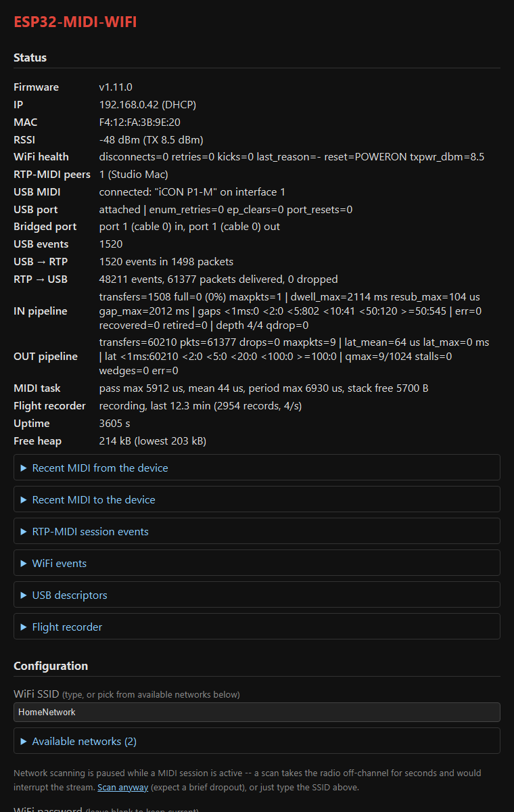

# ESP32-MIDI-WIFI

[](https://github.com/Fohdeesha/ESP32-MIDI-WIFI/actions/workflows/build.yml)

Makes a USB MIDI device wireless. Plug a keyboard, controller or control surface
into an ESP32-S3 and it shows up on your network as an RTP-MIDI (AppleMIDI)
session, which macOS, Windows (with rtpMIDI) and Linux all support. MIDI goes
both ways, so LEDs, motor faders and displays on control surfaces work too.



## Features

- Works with class-compliant USB MIDI devices, in both directions, including
  long SysEx, clock and timecode
- Web page for setup, live status and diagnostics at `http://esp32-midi.local/`
- Accepts session invites, or invites a peer you set
- Choose which of the device's MIDI ports to bridge, or merge them all
- Firmware updates over WiFi, with automatic rollback if a new build keeps
  crashing
- Opens a setup hotspot if it can't reach your WiFi
- DHCP or static IP
- No credentials compiled in; settings live in flash and are set from the web
  page
- Settings export to a file and import again, to back up a board or set up
  another one
- A flight recorder that keeps the moments before a dropout

## Hardware

- An ESP32-S3 dev board. The default build is for the `esp32-s3-devkitc-1`
  with 16 MB flash and 8 MB PSRAM; change `board` in `platformio.ini` for
  anything else.
- The S3's native USB port (GPIO19/20) runs in host mode for the MIDI device,
  so flashing and the serial console go through the other connector, usually
  labeled UART.
- The board has to power the MIDI device's USB port. Most dev boards need a
  jumper or an external 5 V feed for that (the USB-OTG pad on the DevKitC-1).
- The onboard RGB LED (GPIO 48) shows WiFi and session state.
- Give it a decent 5 V supply. WiFi transmit bursts pull a lot of current and
  the regulator on many cheap S3 boards sags under it, which is why TX power
  defaults to 8.5 dBm and tops out at 11 dBm.

## Installing

Grab the latest build from
[Releases](https://github.com/Fohdeesha/ESP32-MIDI-WIFI/releases). For a blank
board, flash the merged image over the UART port:

```sh
esptool --chip esp32s3 write_flash 0x0 ESP32-MIDI-WIFI-<version>-merged.bin
```

After that, update over WiFi: open the web page and upload the plain `.bin`
under Firmware update. Or with curl:

```sh
curl -u admin:<password> -F "fw=@ESP32-MIDI-WIFI-<version>.bin" http://esp32-midi.local/update
```

## Setup

1. On first boot the board opens a hotspot called `ESP32-MIDI-Setup` (password
   `midimidi`).
2. Join it, go to `http://192.168.4.1` and log in as `admin` / `midimidi`.
3. Enter your WiFi details and save. The board reboots onto your network at
   `http://esp32-midi.local/`.

Everything else is on the same page: session name, a peer to invite (leave it
blank to just accept invites), which USB MIDI port to use, static IP, which
events stop the flight recorder, TX power and the web password. Saving reboots
the board.

Export saves all of it as a JSON file, passwords included, so keep that file
private. Import loads one back and reboots. Settings a file leaves out keep
their current values. The keys are the config form's field names.

To wipe all settings (a forgotten password, a bad static IP), hold the BOOT
button for 10 seconds while it's running.

## Flight recorder

The board logs every MIDI packet in both directions and every session, USB
and WiFi event, with microsecond times. After a session drop, the heartbeat
stopping, a USB reset or a WiFi drop it records 10 more seconds and stops, so
the lead-up is kept until you re-arm it. Download it from the status page;
`tools/decode_recorder.py` turns the raw file into text.

## Building

You need [PlatformIO](https://platformio.org/).

```sh
pio run                # build
pio run -t upload      # flash over the UART port
pio device monitor     # serial console at 115200
```

The build patches the AppleMIDI library first (`tools/patch_applemidi.py`). Its
only release has a few bugs that matter here, the worst being a debug print on
every SysEx byte that stalls everything. The script fails the build if the
library ever changes, so it can't quietly ship unpatched.

It also builds a patched copy of the Arduino core's web server
(`tools/patch_webserver.py`), which had no time limit on reading a request, so
one bad request could hang it. The core itself is left alone.

The web page is `web/index.html`. The build gzips it into the firmware
(`tools/embed_web.py`), and it gets its data from the device as JSON.

## Changelog

See [CHANGELOG.md](CHANGELOG.md).
